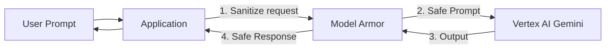

# GKE in AI/ML Applications

Describes how Google Kubernetes Engine (GKE) is customized and configured for
running high-performance AI/ML workloads.

## Integration Details

For AI/ML applications, GKE is configured with accelerator-optimized node pools
(GPUs or TPUs), multi-networking configurations, and high-performance storage
drivers to optimize training and inference throughput.

## Target Configurations

### 1. Accelerator-Optimized Machine Types

Configure node pools with specialized VM families to match workload profiles:

*   **G2 VMs (NVIDIA L4):** Cost-effective, ideal for low-to-medium complexity
    inference and training.
*   **A2 VMs (NVIDIA A100):** High memory capacity, standard for large model
    training.
*   **A3 High/Mega/Ultra (NVIDIA H100/H200):** Ultra-performance training and
    serving. A3 Mega provides 1600 Gbps network bandwidth; A3 Ultra includes
    H200 GPUs and Titanium ML adapters.
*   **A4 VMs (NVIDIA Blackwell B200):** Next-generation scale for trillions of
    parameters.
*   **TPU Node Pools:** TPU v5e (price-performance inference/training) and
    Trillium TPU v6e (up to 4.7x peak compute increase).

### 2. GPU Sharing Configurations

Maximize GPU utilization across smaller inference pods:

*   **Multi-Instance GPU (MIG):** Hard partitioning of A100/H100 GPUs into up to
    7 isolated virtual GPUs.
*   **NVIDIA MPS:** Concurrent execution sharing of execution scheduling and
    memory boundaries.
*   **GPU Time-Sharing:** Context-switching for non-prod or low-throughput
    endpoints.

### 3. High-Performance Storage Integration

*   **Hyperdisk ML:** Read-only block storage volume that can be attached to up
    to 2,500 pods simultaneously, delivering 1.2 TB/s aggregate throughput to
    eliminate model weight loading bottlenecks.
*   **Cloud Storage FUSE:** CSI driver that mounts GCS buckets directly as local
    folder paths on pods. Pair with **Anywhere Cache** to speed up scale-up.

### 4. Multi-Networking & GPUDirect

*   **GKE Multi-Networking:** Enables provisioning up to 9 NICs per pod (1
    control plane, 8 data plane subnets).
*   **GPUDirect TCPX/RDMA:** Bypasses host CPU, allowing direct GPU-to-NIC
    communication to maximize bandwidth during training synchronization.

### 5. Kubernetes Orchestration APIs

*   **JobSet API:** Groups and coordinates PyTorch/JAX worker pods. Restarts the
    entire JobSet if a single pod fails to maintain sync.
*   **LeaderWorkerSet API:** Used for distributed multi-GPU serving. Coordinates
    a leader pod and worker pods (e.g. for vLLM).
*   **Kueue:** Manages job queuing, prioritizations, and fair-share allocation
    of accelerators across teams.

--------------------------------------------------------------------------------

type: ArchetypeBestPractice \
title: Vertex AI in AI/ML Applications \
description: Describes how Vertex AI is customized and configured for AI/ML
Applications. \
timestamp: 2026-06-20T13:11:30Z \
tags: [archetypes, ai_ml, "product:vertex_ai"]

--------------------------------------------------------------------------------

# Vertex AI in AI/ML Applications

Describes how Vertex AI is customized and configured for AI/ML Applications.

## Integration Details

Vertex AI integrates custom model training pipelines and serving endpoints into
AI/ML topologies. It supports foundation models and pipelines.

## Target Configurations

### 1. MLOps Pipeline for Custom Model Training & Serving

*   **Pattern:** Automate model training and deployment using **Vertex AI
    Pipelines** (based on Kubeflow SDK).
*   **Flow:** LAND new data in GCS or BigQuery, trigger a Vertex AI Pipeline to
    preprocess data, execute a custom containerized training job, evaluate the
    trained model, register the artifact in **Vertex AI Model Registry**, and
    deploy it to a **Vertex AI Endpoint** for online serving. Monitor prediction
    traffic with **Vertex AI Model Monitoring** to detect drift.

### 2. Retrieval-Augmented Generation (RAG)

*   **Pattern:** Ground large language models with private data to reduce
    hallucinations.
*   **Flow:** Process unstructured documents from GCS using Document AI,
    generate vector embeddings using Vertex AI text embedding models (e.g.
    `text-embedding-004`), store vectors in **Vertex AI Vector Search** (or
    `pgvector` in Cloud SQL/AlloyDB), and query the vector store to supply
    context to the LLM during user chats.

### 3. Serverless Inference vs. Endpoint Inference

*   **Trade-off:**
    *   Use **Vertex AI Endpoints** for highly active services needing
        low-latency, dedicated compute (GPU/TPU). It has continuous baseline
        costs.
    *   Use **Cloud Run** (with or without GPU) for sporadic, variable, or
        low-throughput inference workloads that benefit from scaling down to
        zero instances.

## Infrastructure Code (Terraform)

### Vertex AI Endpoint

```terraform
resource "google_vertex_ai_endpoint" "model_endpoint" {
  project      = "your-gcp-project-id"
  name         = "image-classifier-endpoint"
  display_name = "Image Classifier Endpoint"
  location     = "us-central1"
}
```

### Vertex AI Dataset

```terraform
resource "google_vertex_ai_dataset" "custom_dataset" {
  project      = "your-gcp-project-id"
  display_name = "training-dataset"
  metadata_schema_uri = "gs://google-cloud-aiplatform/schema/dataset/metadata/image_1.0.0.yaml"
  region       = "us-central1"
}
```

--------------------------------------------------------------------------------

type: ArchetypeBestPractice \
title: Model Armor in AI/ML Applications \
description: Architectural positioning, configurations, and features of Model
Armor for securing generative AI endpoints. \
timestamp: 2026-06-20T13:11:30Z \
tags: [archetypes, ai_ml, "product:model_armor"]

--------------------------------------------------------------------------------

# Model Armor in AI/ML Applications

Describes the architectural positioning, configurations, and features of Model
Armor for securing generative AI endpoints.

## Integration Details

In AI/ML applications, Model Armor is placed inline between the user application
and the Vertex AI or self-hosted model compute endpoints to sanitize input and
output traffic.

## Target Configurations

### 1. Architectural Positioning

Model Armor acts as an inline safety and security gateway placed between the
user-facing application backend and model endpoints.



### 2. Integration Modes

*   **Vertex AI Inline:** Directly integrated into the `generateContent` API
    flow via IAM (`roles/modelarmor.user` role granted to the Vertex AI service
    agent). Activated via project-wide Floor Settings or by passing a Template
    ID in the API request header.
*   **GKE Inference Gateway:** Integrated at the ingress layer via GKE Service
    Extensions, filtering prompt/response traffic to GKE-hosted containers (e.g.
    vLLM) without code changes.
*   **API-based:** Custom applications explicitly invoke `sanitizeUserPrompt` or
    `sanitizeModelResponse` endpoints.

### 3. Core Security Features

*   **Jailbreak & Prompt Injection Detection:** Flags attempts to bypass system
    instructions or force unintended model actions.
*   **Sensitive Data Protection (SDP/DLP):** Identifies and redacts PII (SSNs,
    credit cards, credentials) in prompts and responses.
*   **Responsible AI Filters:** Custom safety confidence thresholds for hate
    speech, harassment, sexual content, and violence.
*   **Malicious URL Scanning:** Scans prompt strings for links associated with
    phishing or malware.

### 4. Policy Configuration

*   **Templates:** Custom configuration settings defining specific filter
    thresholds.
*   **Floor Settings:** A project-wide or organization-wide minimum safety floor
    that takes precedence and cannot be overridden by individual application
    templates.
*   **Enforcement Actions:**
    *   `Inspect only`: Violations are flagged and logged to Cloud Logging
        without blocking requests.
    *   `Inspect and block`: Blocks non-compliant prompts (returning a `400`
        with `blockReason: MODEL_ARMOR`) or responses.
