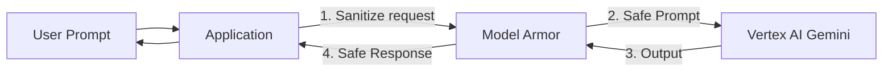

# Early Prompt Filtering

Set up a Client-to-Agent Ingress Agent Gateway with a Model Armor extension.
Filtering out prompt injections before they reach the LLM compute layer
preserves resources and mitigates exploits.

--------------------------------------------------------------------------------

type: PerProductBestPractice \
title: Model Armor Content Sanitization \
description: Content sanitization using Model Armor at the Gateway layer. \
timestamp: 2026-06-25T14:25:24Z \
tags: [best_practices, security, "product:model_armor", "product:vertex_ai",
"product:gke"]

--------------------------------------------------------------------------------

# Model Armor Content Sanitization

*   **Inline Filtering:** Integrate Model Armor inline in the serving pipeline
    (at the GKE Gateway layer) to screen all natural-language prompts and
    responses.
*   **Threat Mitigation:** Use customized templates to detect and block prompt
    injection, jailbreaks, malicious URLs, and sensitive data leakage (PII/PHI)
    using Google's Sensitive Data Protection (DLP) engine.

--------------------------------------------------------------------------------

type: PerProductBestPractice \
title: Model Armor in AI/ML Applications \
description: Architectural positioning, configurations, and features of Model
Armor for securing generative AI endpoints. \
timestamp: 2026-06-20T13:11:30Z \
tags: [archetypes, ai_ml, "product:model_armor"]

--------------------------------------------------------------------------------

# Model Armor in AI/ML Applications

Describes the architectural positioning, configurations, and features of Model
Armor for securing generative AI endpoints.

## Integration Details

In AI/ML applications, Model Armor is placed inline between the user application
and the Vertex AI or self-hosted model compute endpoints to sanitize input and
output traffic.

## Target Configurations

### 1. Architectural Positioning

Model Armor acts as an inline safety and security gateway placed between the
user-facing application backend and model endpoints.

### 2. Integration Modes

*   **Vertex AI Inline:** Directly integrated into the `generateContent` API
    flow via IAM (`roles/modelarmor.user` role granted to the Vertex AI service
    agent). Activated via project-wide Floor Settings or by passing a Template
    ID in the API request header.
*   **GKE Inference Gateway:** Integrated at the ingress layer via GKE Service
    Extensions, filtering prompt/response traffic to GKE-hosted containers (e.g.
    vLLM) without code changes.
*   **API-based:** Custom applications explicitly invoke `sanitizeUserPrompt` or
    `sanitizeModelResponse` endpoints.

### 3. Core Security Features

*   **Jailbreak & Prompt Injection Detection:** Flags attempts to bypass system
    instructions or force unintended model actions.
*   **Sensitive Data Protection (SDP/DLP):** Identifies and redacts PII (SSNs,
    credit cards, credentials) in prompts and responses.
*   **Responsible AI Filters:** Custom safety confidence thresholds for hate
    speech, harassment, sexual content, and violence.
*   **Malicious URL Scanning:** Scans prompt strings for links associated with
    phishing or malware.

### 4. Policy Configuration

*   **Templates:** Custom configuration settings defining specific filter
    thresholds.
*   **Floor Settings:** A project-wide or organization-wide minimum safety floor
    that takes precedence and cannot be overridden by individual application
    templates.
*   **Enforcement Actions:**
    *   `Inspect only`: Violations are flagged and logged to Cloud Logging
        without blocking requests.
    *   `Inspect and block`: Blocks non-compliant prompts (returning a `400`
        with `blockReason: MODEL_ARMOR`) or responses.
