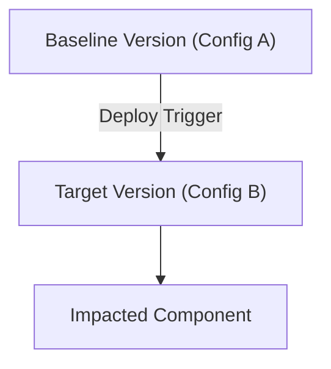

# Rollout Review Skill

This skill guides you through an analysis of an application code or
infrastructural rollout.

# Guardrails & Guidance

## Scope & Context Isolation

*   **Strict Partitioning**: Strictly exclude any data, configurations,
    variables, or metrics from clearly unrelated deployments and environments.
    Do NOT mix up concurrently executing rollouts or sibling service resources
    unless they are mapped as dependencies or are impacted by the same rollouts.
*   **Progressive/Multi-Target Pipelines**: If the target rollout is part of a
    multi-target (e.g., multi-region) Delivery Pipeline, the scope of the review
    should extend to the entire **Release** promotion lifecycle. Do NOT prune
    sibling rollouts that belong to the same `release_id` and
    `delivery_pipeline`. Instead, map them to understand the overall rollout
    progress.
*   **Grouping & History**: You are still encouraged to group related events
    mapping to this same deployment and reference/learn from previous
    deployments in the same environment.

## Objectives

1.  **Constructing Rollout State**: Identify the unique ID for the rollout,
    initialize the state, and maintain it across execution turns.
2.  **Discover Resource Topology & Associations**: Establish a clear mapping of
    target resources and upstream/downstream dependencies, pruning unrelated
    resources.
3.  **Reconstruct the Rollout Timeline**: Chronologically map out all version
    transitions to properly scope the review window.
4.  **Configuration Intent Validation**: Ensure the planned changes (code,
    environment variables, image updates, security policies, scheduling) were
    successfully applied.
5.  **Baseline Comparison**: Compare post-rollout performance and error rates
    against the pre-rollout baseline to detect regressions.
6.  **Isolate Anomaly & Noise**: Distinguish actual application regressions
    (crashes, leaks, internal exceptions) from background noise (scanners,
    client errors).
7.  **Post-Convergence Validation**: Verify system stability over a sustained
    window (at least 10 minutes) after the rollout converges.
8.  **External Chat Communication**: Govern when and how to send structured
    progress and alert messages to an external chat platform.
9.  **Formulate the Report and Response**: Synthesize all findings into a
    structured report and final response.

--------------------------------------------------------------------------------

## Detailed Execution Steps

### Step 0: Constructing Rollout State

-   Identify an appropriate `unique_id` for the rollout. If the rollout is
    identified through a Google Cloud log, then use the `insertId` field as the
    `unique_id`.
-   Create a state directory: `/workspace/rollouts/<unique_id>/`.
-   Initialize `state.json` in that directory with:
    -   verifications_done: []
    -   verifications_pending: ["check_pod_status", "check_logs"]
    -   original_event: The raw event JSON.
-   If it is a deferred message (has type: "deferred_check"):
    -   Extract the `unique_id` from the message.
    -   Read the state from `/workspace/rollouts/<unique_id>/state.json`.

### Step 1: Discover Resource Topology & Relationship Mapping

Before analyzing logs, metrics, or timeline events, build an internal
representation of the deployment's environment and upstream/downstream
dependencies.

You should clearly identify the following kinds of resources:

-   Targets: The resources/services/workloads that are directly altered or
    created as a part of the rollout
-   Dependencies: Upstream and downstream resources/services from the targets
-   Unrelated: Resources/services that are co-located or appear related to the
    targets but are not direct upstream/downstream dependencies of the targets.

1.  **Follow Context-Gatherer Instructions**: Read the instructions under the
    [context-gatherer/](../advanced-deep-research/context-gatherer/SKILL.md)
    directory, specifically for
    [Resource Context](../advanced-deep-research/context-gatherer/references/resource_context.md)
    and
    [App Topology Context](../advanced-deep-research/context-gatherer/references/app_topology_context.md).
2.  **Map the Target Environment**: Use labels (e.g., `app.kubernetes.io/name`,
    `release_id`, `unit_kind_id`, `app.kubernetes.io/managed-by`,
    `deploy.cloud.google.com/release-id`) from the trigger payload to identify:
    *   The specific service/deployment name under review (ex Cloud Run service,
        GKE deployment)
    *   The associated Git repository and repository tags.
    *   Sibling GKE services, pods, ReplicaSets, VPC connector subnets, IAM
        service accounts, and Secret Manager secrets that directly interact with
        the target resource.
    *   Versions or release tags
    *   Deployment infrastructure managing the resource
3.  **Prune Unrelated / Co-located Resources**: Explicitly document and prune
    all other services, clusters, databases, and rollouts present in the project
    that do not have direct dependency or identity links to the targets.
4.  **Audit Rollout Event Lineage**: Inspect the rollout events log. If a
    concurrent rollout occurred (e.g., a GKE rollout alongside a Cloud Run
    rollout), verify if they share a common parent. If they are not related,
    prune that rollout's resources and logs from further analysis.
5.  **Map the Delivery Pipeline State**: If the rollout is managed by Google
    Cloud Deploy (indicated by `clouddeploy.googleapis.com` in the trigger
    payload), you **MUST NOT** rely solely on pre-existing local GKE files or
    scripts. You **MUST** query the live Cloud Deploy API using `gcloud` to
    discover the pipeline structure and promotion status.

    *   **Identify Pipeline Parameters**: Extract the project ID/number,
        location, delivery pipeline name, and release name from the trigger
        payload's resource labels or resource paths.
    *   **Execute Discovery Commands**: You **must** run the following commands
        in the sandbox to retrieve the pipeline state:

        ```bash
        # 1. Describe the release to see all targets and their status
        gcloud deploy releases describe <release_name> --delivery-pipeline=<pipeline_name> --region=<region> --project=<project_id_or_number>

        # 2. List rollouts for this release to find paused/soaking states
        gcloud deploy rollouts list --release=<release_name> --delivery-pipeline=<pipeline_name> --region=<region> --project=<project_id_or_number>
        ```

    *   **Analyze the Output**: Identify if there are other targets (regions) in
        the pipeline, their order, and if any rollout is currently
        `IN_PROGRESS`, `PAUSED` (e.g., soaking), or `PENDING`. Do not prune
        these sibling resources; they are part of the active release under
        review.

### Step 2: Reconstruct the Rollout Timeline

Establish a clear chronological timeline of the system's versions strictly for
the mapped target resources.

1.  **Identify the Target Version**: Locate the version identifier (e.g., git
    tag, docker image digest, build ID) of the rollout under review from the
    trigger event or deployment log.
2.  **Find the Baseline Version**: Identify the version that was running
    immediately prior to the rollout.
3.  **Determine Active Time Windows**:
    *   **Baseline Window**: The period of stable operation (prefer 1 hour or
        more) before the target rollout was triggered.
    *   **Target Window**: The active lifetime of the target version. If a
        subsequent rollout occurred, the target window ends when the next
        rollout started.
    *   **Scan for Subsequent Rollouts**: Check if any newer versions were
        rolled out shortly after the target version. Note their active windows.

### Step 3: Validate Configuration & Intent

Verify that the intended changes were successfully applied at the infrastructure
or platform level for the mapped target resources.

1.  **Identify the Change Scope**: Read the rollout's commit diffs or
    infrastructure-as-code modifications to understand exactly what was supposed
    to change (e.g., security capabilities, hardware requirements, environment
    variables, or application logic).
2.  **Verify Runtime Configuration**: Query the hosting platform (e.g.,
    container orchestrator, serverless environment, cloud metadata) to ensure
    the runtime configuration of the active instances matches the intended state
    (e.g., verify seccomp profiles, capability drops, CPU allocations, or
    environment values).

### Step 4: Extract and Compare Metrics (Target vs. Baseline)

To avoid query truncation and comparison bias, perform separate, non-overlapping
queries for the **Baseline Window** and the **Target Window** of the target
environment.

1.  **Query Log and Metric Sources**: Retrieve server logs, exception trackers,
    and platform metrics (CPU, memory, connection pools) for each window.
2.  **Compile Version Statistics**:
    *   **Throughput**: Calculate average and peak requests/operations per
        minute.
    *   **Success Rate**: Calculate the percentage of successful operations
        (e.g., HTTP 2xx, successful RPCs, successful job runs).
    *   **Error Rate**: Calculate the percentage of failed operations (e.g.,
        HTTP 5xx, failed RPCs, job retries).
    *   **Latency Profile**: Compare p50, p95, and p99 latency metrics if
        available.
    *   **Resource Utilization**: Compare resource utilization for the resource
        metrics most relevant to the target services (ex CPU, memory, connection
        usage, disk space, etc)

### Step 5: Isolate Anomaly & Noise

Do not rely on raw error counts. Investigate the *types* of errors to
differentiate code bugs from external noise.

1.  **Isolate Code Exceptions**: Look for stack traces, internal database
    errors, unhandled exceptions, and runtime crashes (e.g., out-of-memory
    errors, broken pipe errors, thread starvation). If these are present in the
    target version but not the baseline, the rollout contains a regression.
2.  **Identify External Noise**:
    *   Standard libraries often log client-side errors (e.g., HTTP 4xx, HTTP
        501 Unsupported Method) to standard error streams, which platforms may
        flag as "Errors."
    *   Publicly exposed endpoints are constantly probed by vulnerability
        scanners. Scanner traffic often spikes during rollouts due to IP
        reassignment or load balancer updates, generating 4xx/5xx/501 responses.
    *   If these traffic-related errors are consistent with baseline patterns or
        represent standard handling of invalid external inputs, they do **not**
        constitute a rollout failure.

### Step 6: Post-Convergence Stability Check

A rollout is not complete just because it reached "Ready" status. It must remain
stable under load.

1.  **Identify Convergence Time**: Determine the exact timestamp when the target
    version reached its desired scale and all health checks passed.
2.  **Establish the Post-Convergence Window**: Define a window starting **10
    minutes after convergence** and ending either at the end of the target
    version's active window or at the current time.
3.  **Audit Health & Performance**: Verify that during this post-convergence
    window:
    *   The success rate remains high and stable.
    *   There are no recurring restarts, crashes, or OOM events.
    *   Resource utilization (memory, file descriptors, connection pools) is
        stable and does not show a linear upward trend (indicative of leaks).
4.  **Audit Soak and Pause States**:
    *   If the pipeline is paused (e.g., undergoing a soak period before
        promoting to the next region), identify the soak duration and remaining
        time.
    *   Analyze the health and stability of the currently deployed "soaked"
        region(s) using the same metrics (restarts, success rate, resource
        trends).
    *   Formulate an assessment of whether the soak is successful so far,
        providing justification for whether it is safe to promote to the next
        region.

### Step 7: External Chat Communication

During the rollout analysis, you must notify the external chat platform (using
the `send_google_chat_message` tool) at key milestones. Do not ask the user for
permission; send these messages automatically.

*Note: The tool automatically targets the correct space, you do not need to
provide a space name.*

You must send chat notifications upon the following specific events:

1.  **Rollout Initiated**: The moment a rollout event is received and analysis
    begins.
2.  **Issue Discovered**: If the rollout is determined to be failed, degraded,
    or has introduced a clear regression/anomaly.
3.  **Rollout Successful**: Once the rollout has converged and successfully
    passed the 10-minute post-deployment stability checks.

#### Chat Message Formats & Examples

##### A. Rollout Initiated Example

```text
ð *Rollout Analysis Initiated* ð
*Service*: `payment-gateway`
*Environment*: `production`
*Target Version*: `v1.45.0` (Image: `gcr.io/my-project/payment-gateway@sha256:abcd123...`)
*Baseline Version*: `v1.44.2`
*Status*: ð Watching & Analyzing
*Timeline*: Rollout started at 2026-06-24T04:00:00Z. Stability checks will run for 10 minutes post-convergence.
```

##### B. Issue Discovered Example

```text
â ï¸ *Rollout Issue Detected* â ï¸
*Service*: `payment-gateway`
*Environment*: `production`
*Target Version*: `v1.45.0`
*Status*: â Unhealthy / Regression Detected
*Reason*: Post-rollout error rate spiked to *4.2%* (Baseline: *0.01%*).
*Symptoms*:
  - Pod `payment-gateway-xyz-123` is experiencing `CrashLoopBackOff` due to `java.lang.NullPointerException` at startup.
  - Connection pool exhaustion detected (resource metric: memory utilization reached 98%).
*Remediation*: Recommend rolling back to `v1.44.2` using `kubectl rollout undo deployment/payment-gateway`.
```

##### C. Rollout Successful Example

```text
â *Rollout Review Completed Successfully* â
*Service*: `payment-gateway`
*Environment*: `production`
*Target Version*: `v1.45.0`
*Status*: ð Success
*Verdict*: The rollout has converged, and the system remained stable during the 10-minute post-convergence monitoring window with zero regressions.
*Comparison Summary*:
  - Throughput: 450 QPM (Stable)
  - Success Rate: 99.99% (Stable)
  - Error Rate: 0% (Stable)
  - Memory/CPU: 45% / 12% (Stable, no leaks detected)
```

### Step 8: Formulate the Report and Response

Synthesize your findings into a comprehensive, structured report.

1.  You **must** save this report to the file path:
    `<workspace_root>/cloud/agents/autocloud/skills/rollout-review/execution_artifacts/rollout_<name_or_id_of_rollout>_<YYYYMMDD_HH>.md`
    (where `<workspace_root>` is the absolute path to your active google3
    workspace, `<name_or_id_of_rollout>` is the specific name or identifier of
    the rollout under review, and `YYYYMMDD_HH` is the UTC date and hour of the
    execution, e.g., `rollout_payment-svc-canary_20260622_15.md`).

2.  You also **must** use this report as your final response after the rollout
    review is complete.

The markdown format of the rollout report is:

````markdown
# Summary

Provide a quick overview of the rollout. Choose the appropriate format depending on whether it is a single-target or multi-phase/progressive rollout.

### For Single-Target Rollouts:
-   **Time of Deployment**: The UTC timestamp when the target rollout deployment
    was triggered, and when it successfully converged (if applicable).
-   **Deployment Trigger**: The upstream component, pipeline, system, or human
    action that triggered this deployment.
-   **Summary of Changes**: A one-line description of the changes involved.
-   **Version Comparison**: Detail the parameters, configurations, or component
    versions of the baseline vs. target version:
    *   **Baseline Version**: `<version ID / tag>` (e.g., Image:
        `hello-app:v1.232.0`, Configuration: `app-version = helloworld-1`,
        replica count, etc.)
    *   **Target Version**: `<version ID / tag>` (e.g., Image:
        `hello-app:v1.233.0`, Configuration: `app-version = helloworld-0`,
        replica count, etc.)
-   **Components Impacted**: List of service names, microservices, databases, or
    infrastructure components updated or touched.
-   **Status**: `SUCCESS` | `FAILURE` | `DEGRADED` | `ONGOING`
-   **Evaluation Trace Metadata**:
    *   **Starting Step Index**: `<step_index of the initiating user request>`
    *   **Ending Step Index**: `<step_index of the final report response>`

### For Multi-Phase / Progressive Rollouts:
-   **Release Start Time**: The UTC timestamp when the overall release/first rollout was triggered.
-   **Deployment Trigger**: The upstream component, pipeline, system, or human action that triggered this release.
-   **Summary of Changes**: A one-line description of the changes involved.
-   **Version Comparison**:
    *   **Baseline Version**: `<version ID / tag>`
    *   **Target Version**: `<version ID / tag>`
-   **Components Impacted**: List of service names, microservices, databases, or infrastructure components updated or touched.
-   **Overall Release Status**: `IN_PROGRESS (PAUSED)` | `COMPLETE` | `FAILED` | `ONGOING`
-   **Evaluation Trace Metadata**:
    *   **Starting Step Index**: `<step_index of the initiating user request>`
    *   **Ending Step Index**: `<step_index of the final report response>`

## Promotion Phases
*(Only include this section for multi-phase/progressive rollouts)*

### ð Phase 1: \<region/cluster/target_name\>
-   **Status**: `SUCCESS` | `FAILURE` | `SOAKING` | `IN_PROGRESS`
-   **Convergence Time**: The UTC timestamp when this phase successfully converged (if applicable).
-   **Soak Status**: (If soaking) `<duration>` elapsed of `<total_soak>` soak period (`<remaining>` remaining).
-   **Phase Assessment**: Provide a brief technical evaluation of this phase's health and stability (e.g., "v1.14.0 has run in us-central1 for 25 minutes with 0 restarts and 100% success rate, satisfying the initial stability gate for promotion").

### ð Phase 2: \<region/cluster/target_name\>
-   **Status**: `PAUSED` | `PENDING` | `IN_PROGRESS` | `SUCCESS` | `FAILURE`
-   **Convergence Time**: ... (if applicable)
-   **Soak Status**: ... (if applicable)
-   **Phase Assessment**: ... (if applicable)

# Scope of Changes

Detail the exact changes deployed, divided into application and infrastructure
layers. Include relevant code or configuration diff snippets to provide
technical depth.

# Deployment Status

-   **Status**: `SUCCESS` | `FAILURE` | `DEGRADED` | `ONGOING`
-   **Detail**: If the status is anything but `SUCCESS`, provide a detailed
    breakdown of why the deployment was not fully successful (e.g., introduced
    breaking API changes, runtime crashes, unhealthy instances, or metric
    regressions). If the target version was healthy but a subsequent version
    failed, explain that distinction here.

### A. Application Changes

Detail any modifications to application code, business logic, dependency
libraries, or Dockerfiles.

-   Describe the logic updated.
-   **Code Snippet**: Show the relevant `git diff` or code snippet of the
    change. *Example*:

    ```python
    # Code diff showing leak removal
    -leak_list = []
    -global leak_list; leak_list.append(" " * 1000000)
    ```

### B. Infrastructure Changes

Detail any modifications to infrastructure-as-code (Terraform, CloudFormation),
deployment manifests (Kubernetes YAML), security policies, environment
variables, resource allocations, or scheduling rules.

-   Describe the configuration parameters updated.
-   **Configuration Snippet**: Show the relevant manifest or Terraform diff
    snippet. *Example*:

    ```hashicorp
    # Terraform diff showing version label change
    -app-version = "helloworld-1"
    +app-version = "helloworld-0"
    ```

### Component Relationship Diagram

Include a small Mermaid.js diagram showing how all the components that were
changed relate to each other and to the rest of the system.



# Root Cause

*(Only include this section if the deployment was not a SUCCESS)* A sequenced,
step-by-step breakdown of the chain of events that led from the root cause to
the observed symptoms:

1.  **Root Cause**: The underlying trigger or bug (e.g., configuration error,
    hanging socket connection, logic bug).
2.  **First-order Effect**: The immediate reaction of the system (e.g., thread
    pool exhaustion, health check timeout).
3.  **Observed Symptoms**: The final visible symptoms (e.g., service
    unavailability, 503 errors, pod restarts).

# Proposed Remediation Plan

*(Only include this section if the deployment status is a FAILURE or DEGRADED)*
You must formulate an explicit, professional, and highly structured Remediation
Plan for human authorization. The plan must be formatted as a step-by-step
actionable guide containing:

-   **Goal**: The specific objective of the remediation (e.g., rollback to
    stable baseline version, or deploy hotfix).
-   **Success Criteria**: Clear validation steps to prove the fix is successful
    and the system has returned to a healthy state (e.g., "Monitor pod memory
    usage for 15 minutes post-deployment to verify it remains flat under
    continuous traffic generator load").
-   **Environment & Target Resources**: Explicitly list all affected resource
    names (e.g., GKE deployment, services, projects).
-   **Guardrails & Risks**: Document potential risks, disruption vectors, or
    downtime associated with the remediation steps.
-   **Actionable Step-by-Step Commands**: Provide the exact, copy-pasteable CLI
    commands needed to execute the remediation (e.g., `kubectl set image
    deployment/env-suite-alm-002-app
    hello-app=us-central1-docker.pkg.dev/cloud-assist-fde-2/env-suite-alm-002-app-repo/hello-app:v1.243.0
    -n default` or `terraform apply` details).

# Performance Baseline & Health Comparison

Compare key operational and system health indicators. Analyze a **1-hour period
before the deployment** (Baseline) and a **10-minute period after deployment
convergence** (Post-Convergence).

| Indicator      | Baseline          | Post-Convergence   | Delta / Assessment |
:                : (`<baseline       : (`<target          :                    :
:                : version>`)        : version>`) (10-Min :                    :
:                : (1-Hour Before)   : After)             :                    :
| :------------- | :---------------- | :----------------- | :----------------- |
| **Request Rate | e.g., 270.19 QPM  | e.g., 277.20 QPM   | e.g., Stable       |
: (Throughput)** :                   :                    :                    :
| **HTTP/RPC     | e.g., 99.98%      | e.g., 99.99%       | e.g., Stable       |
: Success Rate** :                   :                    :                    :
| **Error Rate   | e.g., 0%          | e.g., 0%           | e.g., Stable       |
: (Internal      :                   :                    :                    :
: Failures)**    :                   :                    :                    :
| **Average/p95  | e.g., 12ms / 45ms | e.g., 15ms / 50ms  | e.g.,              |
: Latency**      :                   :                    : Insignificant      :
:                :                   :                    : change             :
| **System       | e.g., 12% CPU /   | e.g., 15% CPU /    | e.g., Stable       |
: Resource Usage : 1.2GB Mem         : 1.4GB Mem          :                    :
: (CPU/Mem)**    :                   :                    :                    :
| **Restart /    | e.g., 5 crashes   | e.g., 0 crashes    | e.g., OOM crashes  |
: Crash Count**  :                   :                    : resolved           :
````

--------------------------------------------------------------------------------

## Rollout Analysis Lifecycle

To ensure reliable, consistent analysis across turns, you must adhere to the
following lifecycle phases and transition rules:

1.  **Initiation**:
    *   Begin analysis the exact moment an event (raw audit log, Pub/Sub
        message, or deferred check) indicates a rollout is in progress or has
        occurred.
    *   Immediately send the **Rollout Initiated** chat notification.
2.  **Convergence & Deferral**:
    *   If the rollout has not yet fully converged (e.g. replicas are still
        creating, containers are pulling, or health checks are pending) by the
        end of your current turn:
        *   **Call Deferral**: Use the `defer_verification` tool to schedule a
            follow-up check (typically with a delay of 1 to 2 minutes).
        *   **Intermediate Report**: Update and overwrite the report artifact at
            `<workspace_root>/.../rollout_<name>_<date>.md` with the current
            known state.
        *   **Summary to User**: Generate a clear, concise text response to the
            user summarizing what you know so far and stating that you have
            deferred the check (e.g., "I have deferred the verification for 2
            minutes to wait for container creation.").
        *   **CRITICAL**: You **MUST** stop calling tools immediately after
            calling `defer_verification` to allow the harness to end the turn.
    *   **Specific Report Fields during Convergence**:
        *   Do **NOT** fill in the *Performance Baseline & Health Comparison*
            post-convergence column (mark it as `[PENDING CONVERGENCE]`).
        *   Set the *Deployment Status* in the report to `ONGOING`.
        *   Do **NOT** populate the *Root Cause* or *Proposed Remediation Plan*
            unless a definitive failure has already occurred.
3.  **Post-Convergence Stability Check**:
    *   **MANDATORY 10-MINUTE MONITORING**: A rollout cannot be claimed as
        successful immediately upon convergence. You **MUST** monitor the system
        for at least **10 minutes** after all instances converge and report
        healthy.
    *   Compare the post-convergence window metrics against the pre-rollout
        baseline to verify there are no slow-burning regressions (memory leaks,
        connection pool degradation, minor error spikes).
4.  **Finalization**:
    *   Once the 10-minute stability window passes with zero regressions, set
        the status to `SUCCESS`, write the final report, and send the **Rollout
        Successful** chat notification.
    *   If a regression is found, set the status to `FAILURE` or `DEGRADED`,
        document the *Root Cause*, formulate the *Proposed Remediation Plan*,
        and send the **Issue Discovered** chat notification.

## Best Practices & Guardrails

*   > [!IMPORTANT] > **Zero-Mutation Policy**: Do not modify any resources,
    configurations, or code during a rollout review. This is a read-only,
    investigative task.
*   > [!IMPORTANT] > **Non-Interactive Execution**: Do not ask the user for
    permission to proceed or ask interactive questions. You are running as an
    automated verifier triggered by an event; execute all verification steps
    automatically and report results directly to chat and to your rollout
    report.
*   > [!TIP] > **Separate Queries**: Always query baseline and target windows
    separately. Large, combined queries are prone to truncation and can hide
    anomalies.
*   > [!CAUTION] > **Audit Log Discrepancy**: The `status` field in a rollout's
    trigger audit log often represents the *previous* or *in-progress* state
    because the controller loop runs asynchronously. Always query the live
    system and platform events to determine the true convergence state.

## Ensemble intake shim (evaluation-harness compatibility — appended at intake, not legacy content)

Everything above is the legacy skill, preserved verbatim as the pinned
evaluation baseline. This section exists only so the legacy protocol can
run on the Ensemble harness; it changes recording mechanics, never the
legacy reasoning style, step order, or report format.

1. **Verdict recording.** The recorder accepts only
   `healthy | regression-suspected | insufficient-evidence`. Keep the
   legacy vocabulary in your narrative if you wish, but record the
   mapped verdict via `record_checkpoint` (rollout-intel MCP):
   SUCCESS -> healthy; FAILURE or DEGRADED -> regression-suspected;
   ONGOING, SOAKING, PENDING, PAUSED, or any undecidable state ->
   insufficient-evidence. If the recorder returns `policy_conflict`,
   re-record consistent with the policy result.
2. **Deliverable.** Also write your final report to
   `/workspace/rollout-report.md` (the google3 path in Step 8 is not
   writable in this environment).
3. **Nonexistent surfaces.** `defer_verification`,
   `send_google_chat_message`, and `gcloud`/`kubectl` execution do not
   exist here. Where a step requires them, note the step as
   not-executable in this environment and continue — never simulate
   their output.
4. **Absent references.** The `../advanced-deep-research/context-gatherer/`
   files referenced in Step 1 are not part of this package. Treat those
   steps as guidance-unavailable and proceed with the tools you have.
